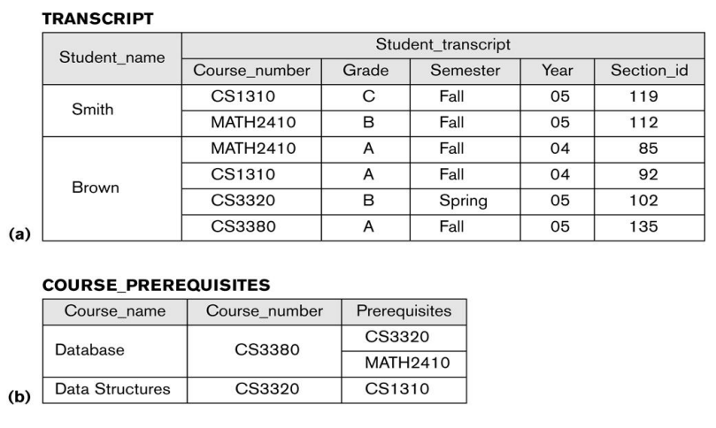

### Nozioni
Collezione di dati correlati. I dati sono fatti che possono essere memorizzati.
Una base dati:
- Rappresenta un certo aspetto del mondo reale
- È una collezione di dati coerenti
- È progettata, costruita e popolate per uno scopo specifico

Il sistema di gestione è il DBMS, software che facilita lavorare con una Base Dati

### Funzioni DBMS
- Definire DB, indicando i tipi di dato, struttura e vincoli
- Costruire la DB
- Manipolare la DB
	- Interrogazioni per query
	- Aggiornare il DB
	- Accedere al DB
- Condividere il DB
- Protezione e Manutenzione
	- Protezione da crash, accessi indesiderati
	- Manutenzione nel corso di vita dl DB
- Processing attivo dei dati 
- Funzioni di presentazione e visualizzazione dei dati
Esempio Università

### Caratteristiche approccio con DB
Rispetto ad una gestione con file il DB:
- Ha una natura autodescrittiva
- Separa programmi e dati, astraendo gli ultimi
- Offre viste multiple
- Condivide i dati in un ambiente multi utente

Il DB tiene sia dati che descrizione di struttura e vincoli nel *Catalogo di sistema* che tiene
- struttura di ciascun file
- tipo e formato di ogni dato
- vincoli
queste informazioni si chiamano **metadati**
I pacchetti software di un DBMS possono interagire con diverse applicazioni DB.

### Separazione tra Dati e Programmi ed Astrazione sui Dati
Un DBMS offre un **modello dei dati** ovvero una rappresentazione concettuale dei dati senza dettagli sulla loro memorizzazione. I programmi che ci interagiscono dunque, interagiscono con i concetti logici più che con l'effettiva memorizzazione dei dati.
Vista la proprietà di indipendenza tra programmi e dati, i dati effettivi e la loro struttura sono salvati nel catalogo separatamente dai programmi.
### Viste multiple sui dati
Essendo multi utenti, questi possono richiedere diverse viste del DB. Una vita è un sottoinsieme del DB o un insieme di dati virtuali.
Esempio di vista	

#### Condivisione Dati e gestioni transizioni in ambienti multi utenti
Essendo che un DBMS deve permettere a più utenti di accedere in contemporanea, deve contenere un software per il controllo della concorrenza.
Quando un processo esegue delle azioni nel DB, questo deve garantire
- isolamento di ogni transazione rispetto alle altre 
- atomicità

#### Utenti del DB
Si dividono in
- Chi progetta o usa il DB amministrativamente
	- Progettisti -> individuano i dati , scelgono le strutture per rappresentarli e interagiscono con gli utenti finali per capire le necessita dell'utente finale
- Chi collabora al disegno, sviluppando software
	- autorizzano l'accesso al DB, lo monitorano e coordinano. Rispondo anche ai problemi che un DB può avere
- Utenti finali, coloro che  usano il DB per interrogazioni o altro.
	- Occasionali -> usano poco
	- Non esperti -> Interagiscono abitualmente via tipi standard
	- Esperti -> comprendono persone che hanno completa familiarità con il DB
	- Indipendenti -> mantengono il DB ad uso personale
- Analisti di Sistema e Programmatori
	- Analisti -> Determinano le esigenze degli utenti
	- Programmatori -> Implementano le specifiche, fanno test e manutenzione

### Vantaggi uso di un DBMS

##### Controllo della ridondanza
La ridondanza dei dati crea rischi nella gestione anche se può migliorare le prestazioni. Il DBMS usa quindi una **ridondanza controllata** , e attua verifiche di consistenza dei dati. Queste verifiche vengono stabilite durante la progressione e imposte al DBMS automaticamente.
