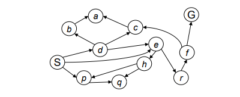
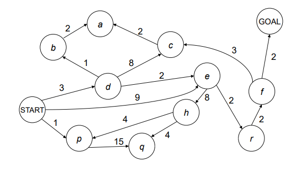

## 26/09/2025
### Alberi di Ricerca
Ampiezza = FIFO
Profondità = LIFO
### General Tree Search
Ritorna soluzione o fallimento, si inizializza con lo stato iniziale del problema.
Se il nodo contiene lo stato obiettivo, allora ritorna la soluzione corrispondente altrimenti espande il nodo e aggiunge i nodi risultanti al search tree.
Il nodo rappresenta la struttura dati dell'albero mentre lo stato sta all'interno del nodo.
- Fringe (Frontiera)
	- Quali nodi dobbiamo espandere?
- Tecnica di Espansione
- Strategia di Esplorazione

### DFS (Depth First Search)
Espandere prima il nodo più profondo, perché la frontiera è implementata come stack. Infatti è uno stack LIFO
Esempio

Partendo da S:
$S -> d, e, p$ = Frontiera in ordine
LIFO -> prossimo nodo da espandere -> p
$p -> d, e, q -> q$ prossimo nodo da espandere
$q -> d,e -> e$ prossimo nodo da espandere
$e -> d, h, r -> r$ prossimo nodo da espandere  
### Proprietà dell'algoritmo di ricerca
- Completezza
- Ottimale
- Complessità di tempo -> quanti nodi si visitano
- Complessità di spazio -> uguale o leggermente minore

- Fattore di ramificazione, Branching factor -> b
- Max Depth -> m
Spazio preso dalla frontiera -> $O(bm)$
### Proprietà DFS
Anche se non ottimale e non completo, garantisce una complessità spaziale $O(bm)$.
## Breadth-First Search (BFS)
Esploriamo livello per livello e andiamo avanti solo dopo aver finito quello precedente.
È ottimale rispetto alla lunghezza della soluzione: se ho lunghezza $n$ la trovo, passerà al livello $n+1$ solo se non c’è la soluzione nel precedente.
Complessità sempre esponenziale: tanti stati visito, tanti ne devo tenere in memoria, $O(b^s)$.
La frontiera cresce e riempie la memoria, soprattutto con un branching factor molto grande.
### Iterative Deepening
Metto un limite di profondità. Se non trovo soluzione aumenta gradualmente il limite.
E' completo entro il limite massimo, quindi è fondamentalmente ottimale, in base a come lo applico quindi.
### Cost sensitive search

$S -> p1, d3, e9 -> p$ minore
$p -> d3,e9,q16 -> d$ minore
$d -> b4,e5,e9,c11,q16-> b$ minore, e9 viene cancellato
$b -> ...$

### Uniform Cost Search
Espande il nodo meno costoso per primo.
Se la soluzione costa $C*$ e gli archi costano almeno $\epsilon$ la profondità effettiva sarà $C*/\epsilon$

## General Tree Search

## Heuristic Function
E' una funzione che stima quanto vicini siamo al goal. Al goal deve valere 0.

### Greedy Search 
Si prende il nodo successivo meno costoso e si va a quello.  Potrebbe succedere che non si arriverà mai al goal.

## A*
Ha come obiettivo di combinare l'UCS e GREEDY.
- UCS -> orders by path cost
- Greedy -> orders in goal proximity

![[attachments/Pasted image 20251009154403.png]]

### Admissible Heuristic
E' inammissibile se l'euristica pecca di ottimalità, togliendo path migliori, quindi se sovrastima i percorsi. Quella ammissibile non sovrastima mai.
Ma quella inammissibile non è sempre da buttare. Ogni tanto potrebbe essere utile un'euristica sovrastimante visto che porta ad una ad una soluzione più velocemente di un'euristica ammissibile.
Quindi la cosa migliore è capire quale euristica è utile in un certo contesto.

h è ammissibile se: $0 <= h(n) < h*(n)$ dove h*(n) è il costo vero.

! date h1, h2 2 euristiche ammissibili -> h(x) = max(h1, h2) è ammissibile