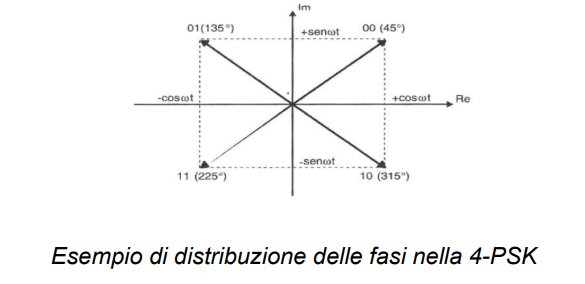
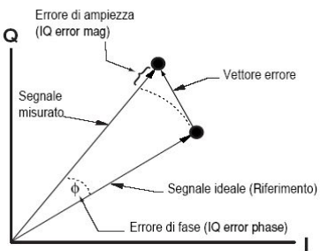
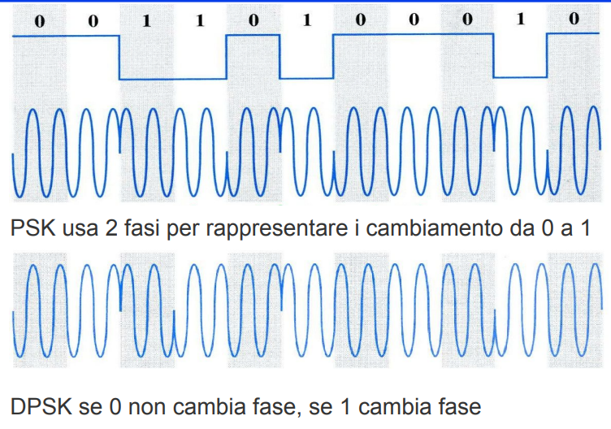
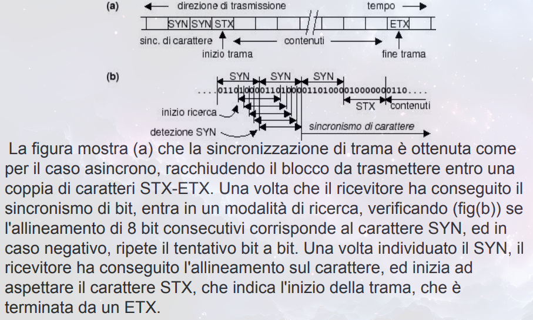
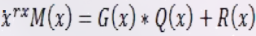
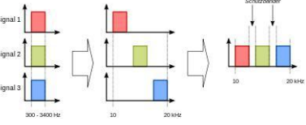
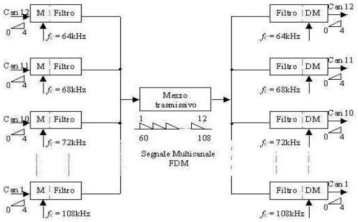
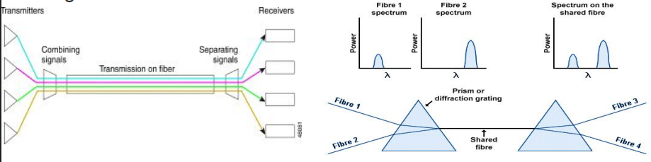
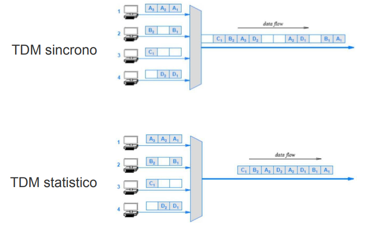

# Lezioni di Teoria - Comunicazione Dati

---

## Indice Generale

### **Primo Modulo**

- [Comunicazione Dati](#comunicazione-dati)
- [Informazione e Misura](#informazione-e-misura)
- [Flussi Trasmissivi](#flussi-trasmissivi)
- [DTE, DCE, CPE](#dte-dce-cpe)
- [Le Reti ed il Loro Mondo](#le-reti-ed-il-loro-mondo)
- [Valutazione della Rete](#valutazione-della-rete)
- [Tipo di Trasmissione](#tipo-di-trasmissione)
- [Classificazione delle Reti](#classificazione-delle-reti)
- [Reti Wireless](#reti-wireless)
- [Struttura delle Reti](#struttura-delle-reti)
- [Reti Mesh](#reti-mesh)
- [Wi-Fi vs Mesh](#wi-fi-vs-mesh)
- [I Protocolli secondo ISO-OSI](#i-protocolli-secondo-iso-osi)
- [La Trasmissione Dati](#la-trasmissione-dati)
- [Segnali Sinusoidali](#segnali-sinusoidali)
- [Sviluppo in Serie di Fourier](#sviluppo-in-serie-di-fourier)
- [Filtri](#filtri)
- [Modulazione di un Segnale](#modulazione-di-un-segnale)
- [Modulazione ad Onda Continua](#modulazione-ad-onda-continua)
- [Modulazione Impulsiva](#modulazione-impulsiva)
- [PDF_6: PCM](#pdf_6-pcm)
- [PDF_7: EVM](#pdf_7-evm)
- [Codifica Differenziale DPSK](#codifica-differenziale-dpsk)
- [Modulazione QAM](#modulazione-qam)
- [Codifica Trellis](#codifica-trellis)
- [Alterazione del Segnale](#alterazione-del-segnale)
- [Limiti della Velocità nel Trasferimento](#limiti-della-velocità-nel-trasferimento)
- [PDF_8: Altri Limiti della Velocità](#pdf_8-altri-limiti-della-velocità)
- [Schemi di Controllo](#schemi-di-controllo)
- [Codifica di Canale (Encoding)](#codifica-di-canale-encoding)
- [Controllo degli Errori](#controllo-degli-errori)
- [PDF_9](#pdf_9)
- [PDF_10](#pdf_10)
- [PDF_11](#pdf_11)

### **Secondo Modulo**

- [PDF_1](#secondo-modulo---pdf_1)
- [PDF_2](#secondo-modulo---pdf_2)
- [PDF_3](#secondo-modulo---pdf_3)
- [PDF_4](#secondo-modulo---pdf_4)
- [PDF_5](#secondo-modulo---pdf_5)
- [PDF_6](#secondo-modulo---pdf_6)
- [PDF_PARTE_FINALE](#secondo-modulo---pdf_parte_finale)

---

## Primo Modulo

### Comunicazione Dati

Per parlare di processo comunicativo, si parla di:

- **Sorgente di informazione**
- **Cammino fisico**
- **Destinatario**

L'**informazione** è l'insieme di dati correlati tra loro. Un esempio è la piramide DIKW.

Il **protocollo** è l'insieme di regole che consentono la comunicazione e definisce **COSA** e **COME**.

Questi protocolli sono definiti da standard stabiliti da organizzazioni come **ISO**, **IEEE**, **ICANN**, **W3C** e senza questi definiti due dispositivi non possono comunicare.

Il **modello TCP/IP ISO** ha 4 layer:

- Network Access
- Internet
- Transport
- Application

---

### Informazione e Misura

L'informazione ha come misura il **bit** e vale:

**Q = log₂M**

dove M è il numero di stati possibili di un sistema e Q i bit necessari per distinguerli.

Un sistema elaborativo deve avere dei **codici** per associare le sequenze di bit ad un carattere come **BCS**, **AIKEN**, **ASCII**, **UNICODE**, ecc.

I più usati sono l'**ASCII** a 7/8 bit, l'**EBCDIC** a 8 bit, l'**UNICODE**.

---

### Flussi Trasmissivi

- **Simplex** → unidirezionale
- **Half duplex** → bidirezionale a turni
- **Full duplex** → bidirezionale diretto

---

### DTE, DCE, CPE

L'applicazione utente risiede nel **Data Terminal Equipment (DTE)** come ad esempio un PC.

Il **Data Circuit Terminating Equipment (DCE)** converte i segnali nella forma migliore per l'invio sul canale.

Il **CPE (Customer Premises Equipment)** si usa in caso sia richiesto un dispositivo di pertinenza dell'utente.

---

### Le Reti ed il Loro Mondo

La **rete** è un insieme di dispositivi connessi. Vi sono uno o più nodi capaci di inviare o ricevere dati.

**Reti ad elaborazione:**

- **Concentrata** → un DTE potente viene messo a disposizione di altri DTE che ne sfruttano la capacità di calcolo
- **Distribuita** → DTE diviso in più punti

Per entrambi i modelli vi sono 3 procedure di colloquio:

- **Inquiry** → forma di interrogazione messa a disposizione da servizi del PC
- **Conversational** → stabilisce delle regole e formati, bloccando quelli diversi
- **Interattivo** → risponde ad applicazioni sensibili. Invia tutte le applicazioni che consentono pieno sfruttamento delle risorse elaborative

---

### Valutazione della Rete

- **Affidabilità** → priva di errori, rimedia ai guasti, gestisce bene le situazioni critiche
- **Sicurezza** → protezione dei dati da accesso, perdite e modifiche indesiderate
- **Prestazioni** →

  - **Ritardo** → misurazione tempo di transito dei dati
  - **Tempo risposta** → tempo tra richiesta e risposta
  - **Throughput** → quantità di dati spediti in unità di tempo

  Queste dipendono da numero di DTE, tipologia dei mezzi e dal software.

  - **Banda** → banda passante di frequenze che può essere usata per la trasmissione dei dati. Massima velocità alla quale è possibile trasmettere informazioni. Per valutare la velocità di banda si usano strumenti come **ping**, **traceroute**, **speedtest**, **pingtest** e **netindex**

---

### Tipo di Trasmissione

- **Point-to-Point** → tra due DTE diretti mediante linea telefonica o dedicata
- **Multi-point** → collegamento condiviso tra più DTE. La condivisione avviene in maniera temporale o condivisione dello spazio del canale

---

### Classificazione delle Reti

- **WAN** → grandi senza limitazione, DTE distanti, arriva fino a Tbits. Sono distribuite, quindi anche se un nodo cade, il routing instrada verso un'altra path.
- **LAN** → 1 o 2 km, uso privato, arriva fino a migliaia Gbits. Possono esserci alcuni DTE che fungono da server.
- **WLAN** → reti locali LAN ma senza fili. Usa lo spettro radio. La velocità dipende dallo standard usato:
  - WiFi 5 (802.11ac) → 3.5 Gbps
  - WiFi 6 (802.11ax) → 9.6 Gbps
  - 2.4 GHz → offre una copertura ampia ma poco potente
  - 5 GHz → copertura meno ampia ma più potente
- **MAN** → livello cittadino, fibra ottica ad alta velocità

> **Docker:** Per sicurezza tutti i software in genere girano come demoni separati all'interno dei software server

---

### Reti Wireless

Usate principalmente per la comunicazione mobile. Abbiamo:

- **WLAN** (802.11)
- **WiMax** (IEEE 802.16x)
- **IEEE 802.20**
- **CDPD** (Cellular Digital Packet Data)

---

### Struttura delle Reti

La **topologia** di una rete è la configurazione geometrica dei collegamenti fra i vari componenti. Sono volte a creare stabilità, a migliorare il rendimento e a diminuire i costi.

- **Rete ad albero** → stazioni a livelli, con un livello centrale. Semplice ma vulnerabile
- **Rete a dorsale** → collegamento multi punto via Ethernet. Questa crea una specie di spina dorsale lungo tutta la rete. Questa rete richiedeva anche una speciale terminazione montata a fine del cavo.
- **Rete a stella** → ogni nodo è connesso ad un dispositivo centrale. È più economica rispetto ad una struttura a maglia completa. Ad esempio un Ethernet con topologia a stella aveva un doppino UTP non schermato, quindi in plastica.
- **Rete ad anello** → molto usata in passato. Ogni nodo ha un punto-a-punto con solo 2 nodi. Ha una trasmissione unidirezionale, ogni nodo rigenera il segnale. Non supporta errori
- **Rete a maglia (MESH)** → tutti i nodi sono collegati tra loro. Il costo totale del percorso è **N(N-1)/2**. Ogni apparato ha un collegamento Duplex.

---

### Reti Mesh

Combinazione di nodi fissi e mobili interconnessi tra loro con link wireless per avere una rete auto-configurante multi-hop.

Offre una grande affidabilità, ha una gestione dinamica dei malfunzionamenti, sia per quanto riguarda il collegamento radio che per quanto riguarda la componente hardware della rete.

Vengono monitorati in tempo reale i percorsi disponibili e selezionati quelli migliori.

Sono soggette ad un alto tasso di errore visto l'utilizzo di onde radio, dunque serve sviluppare protocolli ottimizzati per il wireless.

La maglia usata tra gli access point forma il **wireless backhaul multi-hop**, un sistema di comunicazione che fornisce ad ogni utente servizi a basso costo multi-hop a banda larga.

- **Backhaul network** = rete comprendente nodi intermedi tra dorsale e nodi periferici

La rete Mesh risolve le seguenti esigenze:

- Trasmissione in movimento e simmetrica (uplink-downlink)
- Limiti di banda delle strutture ad albero
- Reti ad-hoc senza infrastruttura
- Configurazione automatica
- Radiolocalizzazione senza GPS
- Resistenza alle interferenze
- 100% degli IP utilizzabili
- Più sicurezza

---

### Wi-Fi vs Mesh

Nelle reti WiFi un guasto blocca tutta la rete mentre nelle reti Mesh si ha maggiore tolleranza ai guasti e flessibilità nella pianificazione.

---

### I Protocolli secondo ISO-OSI

Il compito dei protocolli, ovvero chi gestisce il colloquio tra due DTE o DCE è:

- Gestire il flusso dei dati e gli scambi
- Controllo degli errori
- Sincronizzazione
- Strutturare i dati trasmessi

I protocolli per le relazioni tra due DTE si possono dividere in:

#### **Ambito Primario/Secondario:**

- **Polling/Selecting**
- **BSC**
- **HDLC**
- **SNRM**
- **RTS/CTS** → si basa su interfaccia seriale RS-232. Una stazione che vuole trasmettere manda un segnale alla stazione master attivando il segnale Request To Send. Se il master può ricevere risponde con un segnale Clear To Send. Questa procedura si basa sull'handshake.
- **XON/XOFF** → usato per terminali vicini tra loro. La stazione primaria invia dati, vengono memorizzati e utilizzati. Quando la memoria si riempie viene mandato un carattere XOFF che impedisce l'invio di nuovi blocchi. Appena il DTE si libera manda un messaggio XON
- **Stop and Wait**
- **ARQ** → Automatic Repeat Request o Query. Protocollo Full Duplex che usa il concetto di finestra mobile per essere più efficiente.

#### **Ambito relazioni ibride:**

- **HDLC**
- **PPP**
- **MPLS**

#### **Ambito peer to peer:**

- **TDM**
- **FDM**
- **SDH**

---

### La Trasmissione Dati

Lo strato fisico deve trasportare dati. Questi sono:

- **Digitali** → rappresentazione discreta
- **Analogici** → segnale intenso, continuo

Nei DTE si usa una rappresentazione digitale trascrivendo ogni dato in sequenze di 0 o 1.

I dati vengono sottoposti a:

- Conversione in un differente tipo di segnale digitale, con livello 0 o 1
- Conversione in analogico (modulazione), quindi un segnale con diversi livelli di intensità

---

### Segnali Sinusoidali

È un segnale che varia nel tempo secondo la legge:

**U = U sin(ωt + Φ)**

dove:

- **t** è il tempo trascorso
- **ω** velocità angolare
- **Φ** lo sfasamento di fase

La curva descritta prende il nome di **sinusoide**.

Questa curva rappresenta il valore del seno dell'angolo istante per istante che ruota in senso antiorario con velocità **ω**. Quindi **Φ** rappresenta l'angolo che viene formato con l'asse x all'istante 0.

Ruotando tornerà alla posizione di partenza e si ripeterà. Il numero di volte al secondo che il segnale torna allo stato di partenza si chiama **FREQUENZA** e viene calcolata in **Hertz = 1/t**.

Un segnale che ha una frequenza di **1 KHz** vuol dire che percorrerà la circonferenza 1000 volte al secondo. La velocità è data dunque da **2πf**. Il periodo che sta nel mezzo della ripetizione del segnale si chiama periodo.

**ω = 2πf**

Dunque un'onda portante sinusoidale ha forma del tipo:

**s(t) = A cos(2πft + Φ) = A sin(ωt + Φ + π/2)**

con:

- **A** ampiezza della portante
- **f** frequenza
- **Φ** fase

Un **periodo** è dato dall'unità di tempo diviso la frequenza → **T = 1/f**.

Dunque un segnale con **1 KHz** di frequenza ha periodo di **1/1000 = 1 millisecondo**.

La **lunghezza d'onda λ** mette in relazione frequenza e velocità di trasmissione:

**λ = C/f** dove **C = 300.000 km/sec**

Lo **spettro** è l'insieme di frequenze che il segnale contiene.

La **larghezza di banda** è l'intervallo delle frequenze contenute in un segnale composto. Se un segnale ad esempio trasmette da 300 Hz a 3400 Hz la sua larghezza sarà 3100 Hz.

---

### Sviluppo in Serie di Fourier

Il teorema di Fourier ci dice che un segnale periodico può essere considerato come la somma di infinite sinusoidi diverse.

Matematicamente:

**S(t) = A₀ + A₁ sin(ωt + φ₁) + A₂ sin(2ωt + φ₂) + A₃ sin(3ωt + φ₃) + ...**

Utilizzando sempre più segnali sinusoidali diversi e opportuni, il segnale ricostruito in giallo è sempre più tendente ad una forma quadrata. Questo si ha passando da un'analisi dalla 3ª alla 9ª armonica. Il numero di armoniche usate per la ricostruzione di un segnale varia in base alla potenza del segnale da rappresentare. In genere si considera l'armonica sino a che la sua ampiezza non sia **1/10** della grandezza originale.

L'analisi di Fourier ci ricorda che un segnale digitale è un segnale analogico composto da banda teoricamente infinita. Nasce il problema di come trasmettere il segnale analogico come digitale tra 2 punti.

---

### Filtri

Sistema che tratta in modo specifico le componenti di un segnale a frequenze diverse. Aiuta a separare le informazioni o eliminare il disturbo.

I **filtri attivi** usano amplificatori operazionali o transistori, quelli **passivi** usano componenti come resistori o condensatori.

#### **Filtro Passa Basso**

Permette il passaggio di frequenze sotto una certa soglia, chiamata frequenza di taglio. In questa sussiste la relazione:

**Vout / Vin = 1/√2**

dove **Vout** è il segnale in uscita e **Vin** quello in entrata. Così è attenuato circa di un 30%.

#### **Filtro Passa Alto**

Permette il passaggio di frequenze al di sopra della frequenza di taglio.

#### **Filtro Passa Banda**

Permette il passaggio di frequenze all'interno di un certo range detto _banda passante_ e attenua quelle fuori da questo range.

#### **Filtro Elimina Banda o Filtro Notch**

Blocca un certo intervallo di frequenze **ωL - ωH**.

---

### Modulazione di un Segnale

Il DTE sorgente immette nel canale un segnale digitale con distribuzione di energia troppo ampia per poter stare dentro un canale telefonico, deve quindi essere convertita.

La **modulazione** è un'operazione secondo la quale un segnale **portante** viene modificato in un parametro essenziale in accordo al segnale informativo d'ingresso, **modulante**.

---

### Modulazione ad Onda Continua

Ha 3 tipi di modulazione analogica:

#### **AM (Amplitude) - Modulazione di Ampiezza**

Sistema per il quale si modula l'ampiezza del segnale che si deve trasmettere **portante** in maniera proporzionale al segnale che si intende trasmettere, **modulante**.

Così il segnale modulato ha la stessa frequenza del segnale portante.

In digitale lo 0 è bassa potenza e l'1 alta potenza.

Trasmettendo un segnale modulante del tipo **vm(t) = vm cos(ωmt + Φ)** ponendo **Φ = 0**.

Sia la portante **vp(t) = vp cos(ωpt)** con frequenza maggiore, il segnale modulato in ampiezza diventa:

**v(t) = [Vp + KaVm cos(ωmt)] cos(ωpt)**

#### **FM (Frequency) - Modulazione di Frequenza**

Nella AM il rumore che cade nella banda del segnale si somma, degradando così il contenuto informativo. Nella modulazione di frequenza l'ampiezza resta standard, ma cambia la frequenza del segnale. Più l'onda modulante aumenta più l'onda si infittisce. Ha un'efficienza maggiore e risente meno dei disturbi, ma è più complessa da costruire.

La pulsazione della portante varia di frequenza, proporzionalmente al valore della modulante, lasciando l'ampiezza **Vp** inalterata.

**vm(t) = VM sin ωmt**

**vp(t) = Vp sin(ωpt + mf sin ωmt)**

con **mf = (Kf VM)/ωm = (Kf VM)/2πfm = Δf/fm**

#### **PM (Phase) - Modulazione di Fase**

Simile alla modulazione di frequenza, ma la frequenza del segnale portante è più stabile. Viene spesso usato per amplificare il segnale di sistemi di frequenza.

Si fa variare la fase della portante in modo direttamente proporzionale all'ampiezza modulante.

**VPM(t) = VP cos(ωPt + Kp Vm sin ωmt)**

---

### Tabella Riassuntiva AM-FM-PM

| Caratteristica          | AM              | FM        | PM                                |
| ----------------------- | --------------- | --------- | --------------------------------- |
| Parametro modificato    | Ampiezza        | Frequenza | Fase                              |
| Robustezza al rumore    | Bassa           | Alta      | Alta                              |
| Complessità             | Bassa           | Alta      | Alta                              |
| Impiego tipico          | Radio analogica | Radio FM  | Comunicazioni digitali (PSK, QAM) |
| Ampiezza della portante | Variabile       | Costante  | Costante                          |

---

### Modulazione Impulsiva

È un tipo di modulazione dove l'informazione è codificata in una serie di impulsi.

#### **PAM (Pulse Amplitude Modulation)**

Il segnale analogico varia l'ampiezza del treno di impulsi che costituisce la portante.

#### **PWM (Pulse Width Modulation)**

L'informazione è codificata sotto forma di durata temporale degli impulsi di un segnale. Il modulante varia la larghezza degli impulsi.

#### **PPM (Pulse Position Modulation)**

Le ampiezze degli impulsi sono identiche, ma la loro posizione viene modificata in base al segnale della modulante. Più il segnale è positivo più viene ritardata la posizione degli impulsi rispetto a quella di riposo e viceversa.

#### **PCM (Pulse Code Modulation)**

Si applica a canali telefonici e permette di fare passare su un solo cavo coassiale fino a 30 telefonate.

---

## PDF_6: PCM

### PCM (Pulse Code Modulation)

Per la sua realizzazione si effettuano 3 operazioni a partire dal microfono di ingresso:

#### **Campionamento**

**Teorema di Shannon:** un segnale a banda limitata compreso tra due frequenze **f₁** e **f₂** | **f₂ > f₁** può essere rappresentato mediante una successione di campioni prelevati con frequenza pari a **2f₂**.

Si assume come frequenza di campionamento il valore **fc = 8 KHz** superiore di **1,2 KHz** al valore minimo di **2f₂ = 6,8 KHz**.

Il periodo sarà dunque **T = 1/fc = 1/8000 = 125 μsec**

Si definisce **frequenza di Nyquist** la minima frequenza necessaria per campionare senza perdere informazione. La minima frequenza è pari al doppio della banda.

Il segnale viene quindi prima campionato poi sostituito dalla frequenza PAM.

#### **Quantizzazione**

Il dato per essere trasmesso deve assumere solo determinati valori discreti e finiti.

Si definisce prima un massimo e un minimo e si divide l'intervallo creato.

Nella **quantizzazione uniforme** ogni sotto-intervallo è uguale ad ogni altro sotto-intervallo.

Dato **n** il numero di bit usati:

- Il numero di livelli sarà **M = 2ⁿ**
- L'ampiezza **q = Vpp/M**
- La varianza **q²/12**

Essendo la quantizzazione irreversibile, occorre tener conto dell'**errore di quantizzazione**, nato dal fatto che il segnale vocale può avere infiniti valori mentre la sua discretizzazione no.

È provato che usando **256 livelli** l'orecchio umano non percepisce differenza.

#### **Codifica**

L'ampiezza degli impulsi viene trasformata in bit.

Ad esempio se l'ampiezza iniziale del primo impulso è di 5V, sarà rappresentata dalla sequenza binaria **101**.

**Esempio:** vengono spediti 96 impulsi. Il n.0, n.32 e n.64 saranno da vedersi consequenziali come il 5, 37, 69. Di questi 32 impulsi il n.0 serve per dettare il sincronismo, il 16 per il controllo della bontà di trasmissione.

In totale di 30 canali vocali, 2 sono di servizio.

Vengono trasmessi 32 canali con 8000 campioni al secondo. Ogni canale contiene 8 bit, quindi al secondo vengono trasmessi:

**Vbit = 32 × 8000 × 8 = 2048 Mbit/s**

Si possono raggruppare più canali.

---

### Modulazioni Digitali

Tecniche che modulano segnali digitali, ossia 0 e 1 o -1 e +1.

#### **Modulazione per Modem di Banda Base**

Per il collegamento tra 2 DTE si parla di codifica volta ad eliminare segnali di bassa frequenza e segnali in componente continua.

Il digitale rimane lo stesso, ma vengono fatte delle modifiche alla portante rispetto al modulante.

#### **ASK (Amplitude Shift Keying)**

La modulazione a spostamento d'ampiezza trasmette i bit modificando l'ampiezza della portante.

**s(t) = { A cos(2πft) se bit=1, 0 se bit=0 }**

Semplice ma sensibile al rumore.

#### **FSK (Frequency Shift Keying)**

Modulazione per spostamento di frequenza. I bit vengono trasmessi variando la frequenza della portante mantenendo ampiezza e fase costanti.

Più robusta di ASK ma richiede banda maggiore.

#### **PSK (Phase Shift Keying)**

Si trasmettono i bit modificando la fase portante, mantenendo ampiezza e frequenza costanti. Molto robusta ma può causare discontinuità.

#### **BPSK (BiPolar Phase Shift Keying)**

La portante mantiene valori costanti per ampiezza e frequenza, ma per garantire massima protezione da rumore, vengono usati due valori opposti di fase in base al valore del bit: **0°** e **180°** per rispettivamente bit 1 e bit 0.

Quindi, l'onda "invertirà" il segnale quando vi sarà un valore 0, mentre per valore 1 rimane uguale.

#### **4-PSK**

Modulazione digitale a 4 fasi. I bit vengono riuniti in coppie usate per modulare in fase la portante sinusoidale (dibit).

I due bit generano due flussi separati meno veloci di quello originale.

Le due portanti hanno stessa frequenza, ma le loro fasi differiscono di 90°.

La fase del segnale in uscita dal primo modulatore può assumere valori **0°** e **180°**, il secondo **90°** e **270°**.

Infine vengono sommate generando un segnale che può assumere 4 fasi diverse: **45°, 135°, 225°, 315°**.

Il circuito sfasatore sfasa il segnale portante di 90°.

Al blocco di separazione è applicato in ingresso il segnale modulante **Vi** che viene separato in bit pari (P) portati al moltiplicatore 1 e dispari (D) portati al moltiplicatore 2.

Inoltre il separatore associa allo stato logico basso +1, mentre a quello alto -1, così da avere un segnale in fase (livello basso) o sfasato di 180° (livello alto) all'uscita del moltiplicatore.

---

### Diagrammi a Costellazione

Rappresentazione teorica del segnale, usata per la comprensione del suo stato.

Il segnale trasmesso in digitale è diviso in 2 segnali modulati in quadratura che non interferiscono denominati **I** e **Q** (In-fase e Quadratura).

Si crea un diagramma su piano con I e Q come assi e in base allo schema di modulazione i punti nel diagramma saranno più o meno fitti.

Il problema è che a causa di interferenze, il vettore del segnale modulato non si trova in uno dei punti previsti, ma leggermente più o meno spostato a seconda dei disturbi.

---

### Vettore Errore

Differenza tra il punto teorico e il punto reale.

Può essere descritto caratterizzato dal suo modulo e dalla sua fase.

I vettori errore descrivono quanto "balla" il segnale ricevuto nei dintorni del punto teorico.

Misurandone tanti e tenendo in considerazione il valore quadratico medio del modulo, si ricava un parametro che descrive la qualità intrinseca della modulazione.

---

## PDF_7: EVM

### EVM (Error Vector Magnitude)

Questo parametro esprime il valore % dell'errore rispetto al segnale.

Può essere calcolato anche come rapporto espresso in dB tra valore quadratico medio della potenza del vettore e il valore quadratico medio della potenza del segnale ideale di riferimento.

**Più grande EVM peggiore la qualità.**

Essendo valori piccoli il rapporto espresso in dB assume valori estremamente piccoli. Tanto più negativi quanto migliore il segnale.

> Un valore EVM% di **0,10 (10%)** rappresenta un segnale peggiore rispetto ad un altro con EVM% di \*\*0

---

# Da qui in poi claude ancora non me lo ha impostato per bene :)

---

> Il Bel è definito come logaritmo del rapporto tra grandezza X e il suo valore di riferimento $X_0$.
> 1 Decibel è pari ad 1/10 di Bel. Il decibel relativo ad una grandezza X generica viene espresso nella forma $dB_x = 10log(X/X_0)$.

x=0 => logaritmo = -inf
x=1 => logaritmo = 0
x=valore della bale => logaritmo = 1

E' facile intuire come i valori sempre più negativi di EVM sono i migliori.

EVM si misura con vari strumenti, come analizzatore di segnali, di modulazione, vettoriale,...
E' comune anche la versione software, usato su analizzatori di spettro, digitalizzatori od oscilloscopi.

Il segnale viene demodulato, dai dati demodulati viene ricostruito il segnale ideale che avrebbe dovuto esserci, poi per differenza si ottiene il segnale errore la cui elaborazione porta all'EVM.

Il modo in cui viene riportato dipende dallo strumeto usato. Può essere in forma sintetica tabellare, percentuale o dB.
Può essere anche un grafico della sua evoluzione nel dominio di tempo.
Alcuni strumenti analizzano la fase del vettore altri solamente il modulo.

### Codifica Differenziale DPSK

Per evitare complicazioni di norma si usa una modulazione differenziale, DPSK.
Ai due livelli binari corrisponde o nessuna variazione o 180° (come sopra).
La prima cifra del segnale si individua inviando una sequenza prestabilita ad inizio comunicazione.
Un segnale DPSK ha lo stesso andamento di un PSK quindi ha le stesse caratteristiche spettrali.
Si può anche associare la codifica dei due bit con
$01=90°, 10=180°, 11=-90°$ o $270$

### Modulazione QAM

Si ottiene combinando ASK e PSK, chiamata anche modulazione di ampiezza in quadratura.
Si può ottenere modulando in ampiezza due portanti della stessa frequenza sommate in quadratura (sfasate di 90°).
Utile per le trasmissioni veloci

### Moodulazione 16-QAM

Dati divisi in gruppi da 4bit (quadribit). Si varia la fase della portante con la regola del 8-DPSK in base agli ultimi 3 bit.
Il primo bit si usa per operare una modulazione di ampiezza sul segnale già modulato in fase
Così si ottengono $2^3=8$ salti di fase, ad ognuno associata un ampiezza corrispondente all'uno o allo zero logico del primo bit.

### Modulazione 64-QAM

Modulazione anch'essa bidimensionale, data dalla combinazione di due PAM modulate con portanti seno e coseno

### Codifica Trellis

"Con Memoria".
Rappresentata da una macchina con due stati e associati al valore -A (S0) o +A (S1) (supponendo ci sia un segnale PAM visto che qui i simboli sono rappresentati da livelli di ampiezza).
Il bit 0 non fa cambiare di stato mentre il bit 1 si.

## Alterazione del segnale

Tutti i processi di modifica che lo differenziano dal segnale originale.

### Attenuazione

Perdita di energia del segnale. Si supera usando strumenti come amplificatori.
L'attenuazione si misura in decibel
Prendendo $P_1 = potenza di output e P_2 = potenza di input$
$dB = 10log_2(P_2/P_1)$

Invece con $V_1 = tensione iniziale e V_2 = tensione finale$ si ottiene la legge che governa la def di decibel per la tensione
$dB = 20log_10(V_2/V_1)$

Fino a 20dB è perfetto, da 60dB in su si consiglia il suicidio.

### Distorsione

Cambiamente della forma del segnale, tipicamente in un segnale costituito da varie frequenze.
A causa dei possibili ritardi tra i vari segnali si possono creare differenze tra la forma del segnale inviato e quello arrivato.

### Rumore

Iniseme di segnali indesiderati che si sovrappongo a quello utile.
La causa più comune è il rumore terminco causato dai componenti di un sistema.
Spesso si usa il rappporto segnale/rumore _SNR_ o _S/N_
$SNR = P_{segnale}/P_{rumore}$
Questo rapporto se da come risultato 28dB sei dio, da 7-10dB, anche qui, si consiglia il suicidio.

### Interferenza

Sovrapposizione di informazioni non desiderate. Contaminazione da parte di segnali esterni.

### Interferenza intersimbolica

E' in generale causata da limitazioni della banda che provocano un arrotondamente dei segnali emetti da un DTE.

### Limiti della Velocità nel trasferimento

Si calolca in bit/sec e supponendo di lavorare su canali telefonici, abbiamo

- canali perfetti, senza distorsioni o ritardi
- canali ideali, solo un ritardo costante
- canali reali, attenuazioni e ritardi in funzione della frequenza dei segnali

Un teorema che lega la larghezza di banda alla quantità di informazione trasportabile è:
$MaxDataRate = 2B * log_2V$
Dove B è la larghezza di banda, V il numero di livelli di tensione differenti presenti nel segnale.

Tenendo conto del rumore si ha
$MaxDataRate = C = B*log_2(1+S/N)$
Con B sempre larghezza di banda, S potenza del segnale e N potenza del rumore.

Con la prima formula ci si ricava il numero opprtuno di livelli V da usare, con la seconda il Max Data Rate reale.

# PDF_8

## Altri limiti della velocità di trasferimento

### Throughtput

Quanto velocemente si possono spedire dati attraverso una rete (reale). La velocità trasmissiva considera quella teorica.

### Latenza

Tempo necessario ad un messaggio per arrivare a destinazione. Si tiene conto di

- tempo di propagazione
- tempo di trasmissione
- tempo di inoltro
- tempo di attesa

### Jitter

Esprime la varibilità del ritardo con cui i pacchetti vengono consegnati.

### Velocità di modulazione e trasmissione

La velocità di modulazione indica il numero di simboli trasmessi in un secondo e viene espressa in baud(simboli/sec). !Un simbolo puù rappresentare più bits.

Velocità di trasmissione e di modulazione sono in relazione

$Velocità_di_modulazione = (Velocità_di_trasmissione)/log_2 n$

### Schemi di controllo

I segnali per essere trasmessi devono essere riconvertiti in digitale con caratteristiche specifiche per il tipo di trasmissione. Ci sono differenze in bae al tipo di trasmissione: asincrona o sincrona.

### Asincrona

Trasmissione non governata da clock, ma con segnali inviati a frequenze e fasi diverse.
La linea viene mantenuta ad uno stato idle quando non vi sono trasmissione (inviando segnale 1), e, prima dell'invio, di dati, viene trasmesso uno start bit che riporta in fase il ricevitore.
Questo sta in ascolto fino alla ricezione di uno stop bit e dopo torna in modalità riposo.

### Sincrona

I dispositivi si temporizzano secondo un clock che dal trasmettitore arriva al master.
Il ricevitore deve avere un sincronism di bit estratto dal flusso di ricezione. Ci deve essere anche un sincronismo di carattere per riconoscere i singoli caratteri.
In generale viene assicurato da un paio di caratteri inviati all'inizio, detto SYN.

Ci sono varie alternative per l'invio del clock, come ad esempio l'invio in linee separate, ricavarlo in base al segnale ricevuto oppure ricavarlo in base ad un circuito di aggancio di fase chiamato PPL (più usato).

## Codifica di canale (encoding)

Tecniche di codifica usate per la sincronizzazione.

### NRZ (not reduced zero)

Stato digitale 1, segnale alto, 0 segnale basso.
Facile e non richiede circuiti complicati. I dati vengono passati direttamente come tali in uscita. Lunghe stringhe potrebbero causare la perdita di sincronismo.

### RZ (return to zero)

Stessa rappresentazione degli stati digitali. A metà dell'impulso, torna sempre a 0.
Il clock ha frequenza doppia per ridurre al 50% la durata dell'impulso.
Il ricevitore distingue tra 3 livelli.
C'è più rischio di errore, ma lunghe stringhe non rischiano di fare perdere il sincronismo.

### Manchester

Divide in 2 parti ugali il periodo di cifratura associando allo 0 logico la transizione dal basso verso l'altro a metà del bit e all'1 logico una transizione dall'alto verso il basso a metà del bit. Raddoppia la banda necessaria. Usata nelle LAN.
Richiede un circuito complicato.

### AMI (Alternate Mark Inversion)

Codice a tre livelli di tensione +V, 0, -V.
Si ottiene dal codice RZ lasciando inalterato lo zero ed associando allo stato logico 1 un valore +V e successivamente un valore -V. Usato in PCM

### Scrambling

Serve a superare i problemi di trasmissione su lunga distanza. Vengono cambiate le regole di codifica in modo da mescolare i bit. Si fa uso di un registro a ciclo. Si usa nella codifica 2B1Q (2 binary one quaternary).
Il flusso di bit su una coppia è sottoposto a scrambling e organizzato in gruppi di due bit.
Ogni gruppo è codificato in uno di 4 possibili livelli.
Aiuta a mantenere costante il segnale.

### Trasmissione orientata al carattere

Usata principalmente in contenuti testuali.
In assenza di start e stop bit si usa un sequenza di caratteri SYN che avviano il sincronismo di bit, individuando i confini di carattere.

Se l'ETX può venire simulato da dati qualunque nel pacchetto, si usa un DLE (Data Link Escape), un carattere di contrllo che all'interno dei dati esegue il byte stuffing, sostituendo gli eventuali ETX.
Per byte stuffing si intende aggiungere uno 0 ogni cinque 1 consecutivi.

### Trasmissione orientata al bit

Dati non organizzati in caratteri, riducendo così l'inefficienza legata ai caratteri di controllo ed evitare dipendenza da caratteri.
Quindi non impiega caratteri di SYN o STX ma degli idle bytes o flag bytes per indicare fine ed inizio di trama.

### Controllo degli errori

Ci sono 3 tipi di errore durante la comunicazione:

- errori single bit -> prendono un solo bit e viene invertito. Comune.
- errori multiple bit -> prendono più bit non consecutivi e li invertono.
- error burst -> due o più bit consecutivi che vengono invertiti. Molto raro.

### Rilevamento degli errori

Si usa una tecnica nota come ridondanza. I bit supplementari aggiunti sono bit ridondanti distruitti appena il ricevitore è sicuro di avere una trasmissione corretta.
Ci sono 3 algoritmi:

#### VRC (Controllo Ridondanza Verticale)

Si aggiunge un singolo bit all'unitò in modo che il numero di bit uguali a 1 diventi pari o dispari. Le primo caso si parla di pairty check, nel secondo di disparity check.
Facile da implementare ma ha diversi limiti. Se c'è un'inversione dei bit pari, non viene rilevato l'errore.

#### LRC (Contrllo ridondanza longitudinale)

Come nel VRC si ha un bit di parità per ogni unità di dati, ma ad ogni blocco viene aggiunt unaa unità supplementare che contiene i bit di parità associati alle sequenze di bit corrispondenti. Assicura maggiore affidabilità ma può essere tratto ancora in inganno da trasposizioni di byte.

#### CRC (Controllo di Ridondanza Ciclica)

Orientato ai bit, asssocia ogni sequenza di k bit ai coefficienti di un polinomio di grado k-1

Viene associato ad ogni sequenza un checksum tale che il polinomio generato dalla sequenza sia divisibile per G(x), polinoimo conosciuto a priori da ricevitore e mittente.
Un checksum si calcoloca così:

1. aggiunngo r bit 0 al segmento ottentendo una sequente m+r di bit corrispondente al polinomio $x^rx M(x)$ con r gradi di G(x) e M(x) polinomio corrispondente alla sequenza iniziale.
2. divido $x^rx M(x)$ per G(x) con divisione mod 2

R(x) è il polinomio corrispondente al checksum.

3)sommo R(x) a $x^rx M(x)$ ottenendo il segmento da trasmettere con checksum.

Non tutti i polinomi G(x) sono adatti allo scopo visto che può avvenire una collisione tra due checksum di sequenze diverse.
Alcuni suggerimenti per G(x)

- con polinomi aventi $x^0 = 1$ gli errori pari ad un bit osno sempre rilevati
- polinomi con x+1 come fattore permettono la rilevazione di errori di numero dispari
- r deve essere il più grande possibile
- nel caso di errori brust, con errore iniziato a i e finito in j il vettore errore si esprime come $e(x) = x^j+...+x^i$. Il numero di termini di questo polinomio è dato dal numero di errori della raffica ossia L=i-j. Ci saranno 3 classi
  - L<=r tutti gli errori verranno rilevati
  - L>=(r+1) l'errore non viene rilevato con probabilità pari a $(1/2)^{r}$
  - L=(r+1) errore non rilevato con probabilità pari a $(1/2)^{r-1}$

# PDF_9

## Multiplazione

Utilizzo dello stesso canale per più comunicazioni separate.

### FDM (Frequency Division Multiplexing)

Le comunicazioni vengono shiftate ad una frequenza superiore con un certo gap ed inviate.
Nella rete telefonica ancora è ampliamente usata questa tecnica.

Considerando la banda fonica di larghezza B = 4kHz, ciascun canale multiplato occuperà una banda di 4kHz, distinta dalle bande di altri canali.
Il numero di canali N multiplabili dipenderà dalla capaictà del mezzo trasmissivo di trasferire senza distorsioni un segnale complessivo di con larghezza BT = NB = N \* 4kHz.
Il processo di traslazione è realizzato mediante modulazione di ampiezza di N portanti dette anche frequenze vertici.
In ricezione il segnale dovrà essere demultiplato. Si filtrano le bande relative a ciascun canale e si demodula l'onda risultante per esstrarre segnale in banda base.
Le frequenze delle varie portanti vegnono scelte per permettere da 12 a 10800 canali multiplabili.
Questo segnale essendo analogico è molto sensibile al rumore.

In questo esempio ci sono 12 canali multiplati traslati in frequenza con portanti distanti di 4kHz (64-68.....-108 kHz). La banda del segnale trasmesso ha una larghezza di BT=12x4 kHz = 48kHz

### WDM (Wavelength Division Multiplexing)

Usata per segnali ottici, in modo da poter ottimizzare l'utilizzo di fibra ottica.
Si modula la lunghezza del raggio luminoso così da inviare diversi raggi in contemporanea.

### D-WDM (Dense Wavelength Division Multiplexing)
Capace di modulare fino a 16 lunghezze d'onda alla distanza di 0.08nm. Tali lunghezze sono modulate con flussi TDM e raggiungono velocità di 1Tb/s.
#### EDFA
Amplificatori in fibra ottica drogata, usano un tratto di fibra drogata di lunghezza L come mezzo perl'amplificazione del segnale ottico. Segnale ottice ed uno di pompa vengono multiplati in una fibra drogata ed il segnale risulta amplificato per effetto dell'emissione di fotoni grazie all'interazione del segnale ottico di pompa con gli ioni del drogante

### C-WDM (Corsae Wavelength Division Multiplexing)
Usata per reti metropolitane a basso costo. Usa maggiori spaziature tra i canali con risparmio a livello economico.
La spaziatura è di crica 20nm con frequenze da 1310nm e a 1610nm.

### TDM (Time Division Multiplexing)
Usa la temporizzazione per i differenti segnali. Può essere sincrono o statistico:
  - in tdm sincrono gli intervalli vengono scelti indipendeentemente dalla presenza di dati da spedire
  - in tdm statistico gli intervalli vengono allocali soo quando ci sono dati da spedire.
Un segmento di dati è quindi diviso in base al numero di canalisi logici che possono essere usati.
In quello statistico non c'è corrispondenza fra dato e canale, cosa che invece in quello sincrono c'è.

### Modem
Contrazione di Modulatore/Demodulatore.
Converte in segnali che arrivano dal DTE in segnali adatti per la trasmissione solitamente in linea telefonica.
Si parla quindi di modem fonici, con range di frequenze da 300-3400Hz.
Svolge diverse funzioni:
  - trasforma un segnale numero dal DTE in segnale anlogico e viceversa
  - gestisci circuiti di comando e controlla l'interfaccia
  - corregge errori e anlizza i dati che riceve.
Oltre ai modem fonici possiamo anche considerare altri tipi di modem,
quali:
  - modem ISDN (128 kbps)
  - modem xDSL (da 640 kbps a 100 Mbps)
  - modem per PLC - Power Line Communications, su linea elettrica (640 Kbps – 200 Mbps)
  - modem GPRS/UMTS/HSDPA/LTE, spesso integrati nei cellulari o come Pc card (56 Kbps – 7.2 Mbps - 100 Mbps)
  - modem in banda base, collega direttamente due utenti su doppino telefonico
Ognuno dei modem visti può essere interno o esterno, con gli
svantaggi e i vantaggi del caso.

Modem esterni:
  - modem seriali (cavo COM1/2)
  - modem paralleli ( cavo parallelo alla LPT1/2)
  - modem usb

Modem interni:
  - modem interni PCI => lavorano sul BUS PCI
  - modem interni PCMCIA o PC card => usati solo in pc portatili

Il modem fonico opera una modulazione per comprimere la banda del segnale.
  - bassa velocità: fino a 1200 [bit/s] => modulazione FSK
  - a velocità media: fino 4800 [bit/s] => modulazione PSK o DPSK
  - alta velocità: oltre 9600 [bit/s] => modulazione QAM
Influenzano la velocità fattori come il tipo di esercizio e d il tipo di trasmissione.

Lo standard delle tecniche di interfacciamento viene deciso dall'ITU. Ogni sigla ha una specifica di progetto.
  - FSK V.21
  - QAM V.29 => codifica multilivello su 4 bit. Spettro di circa 2400Hz con portante di 1700(+1)Hz
  - QAM V.32 => modalità sincronoa ptp con modulazione QAM, 2400 baud, quadribit su 16 livelli. 9600 bit/s. Implemente la codifica Trellis e la soppressione dell'eco.
  La Trellis assicura una immunità più alta al rumroe. Si aumenta la ridondanza della trasmissione. Ogni 4 bit uno ridondante. Ci sarà quindi una costellazione di 32 livelli.
  La soppressione dell'eco si realizza inviando in full-duplex il segnale ed una sua replica invertita così da poter usare la stessa portante e la stessa tecnica di modulazione.
  - Modem V.34 => collegamenti con due terminazioni analogiche. Velocità di 28880 bit/s. Usa una codifica non lineare, multidimensionale e sfrutta tutta lla band disponibile.
  - Modem V.90 => migliora le prestazioni del V.34:
    - il flusso verso la rete è minore
    - il segnale verso l'utente è tipo dati
  - Modem V.92 => Aumenta l'up stream a 48Kbps, usa il quick connet, mantine le connessioni attive fino a 16 minuti, usa una codifica adattiva.

### ADSL (Asymetrical Digital Subscriber Line)
Il doppino telefonico possiede una discreta banada che però viene limitata a osoli 4kHz.
Per ovviare a ciò si usano due tecniche per modulare il segnale.
- CAP (Carrie-less Amplitude Phase), una versione più sofisticata di QAM e DMT.
Tale tecnologia modula un insieme di 256 sottoportanti distanti 4.3125kHz per rientrare nella banda 26kHz-1, 1MHz.
La banda si può suddividere in 3 zone.
  - una bassa fino a 4kHz
  - una media per l'upstream
  - una alta per il downstream
Le velocità teoriche sono dell''ordine degli 8Mbit/s in downstream e 800kbit/s in upstream.

Questa tecnologia non è ancora standardizzata, ogni costruttore ha ua sua variante. Le linee guida sono dettate dallo standard ANSI T1.423. Ammette solo la modullazione DTM, aggiunge la modalità di adattamento di rateo e la connessione a livello di internetworking con reti ATM.

#### Interfaccia Centronics Parallela
Interfaccia parallela a 8 bit asincrona usata ad esempio per collegamento pc stampante. Monodirezionale.
Si possono ormai anche avere collegamenti di dispositivi input.
Connettore di tipo D a 25 poli Femmina.
Ci possono essere fino a 3 interfacce LPT parallel, ognuna con 3 indirizzi contigui per le periferiche.
Il primo registro contiene i dati, il secondo tiene lo stato della stampante.

#### Interfaccia RS232
Sul DTE sta la spina, sul DCE la presa.
Alcuni DCE non hanno la presa esterna visto che il cavo entra dentro direttamente.
In generale il connettore per la Rs-232C è a 25 poli mentre in altre applicazione potrebbe essere in uno un connettore a 9 poli.
Caratteristiche delle linee(circuiti) dell'interfaccia V.24. Il numero di linee dipende dal tipo di collegamento e dai modem impiegati.

C101 => massa di protezione => linea collegata alla massa dei segnali C102
C102 => massa di segnali => linea comune di riferimento per tutti i circuiti
C103 => dati in trasmissione (DTE a DCE) => i dati binari in forma seriale generati dal DTE vanno verso il DCE.
C104 => dati in ricezione (DCE a DTE)
C105 => richiesta di trasmissione (DTE a DCE) => trasmette la portante in linea
C106 => pronto a trasmettere (DCE a DTE) => il DCE è pronto a trasmettere in linea e rappresenta la risposta alla linea C105
C107 => Modem pronto (DCE a DTE) => modem collegato
C108 => DTE pronto (DTE a DCE)
C109 => portante in rcezione (DCE a DTE) => la portante in linea è ad un livello superiore alla soglia di ricezione.
C110 => rilevatore della qualità del segnale (DCE a DTE) => tutti i dati sono corretti
C111 => Selezione di velocità (DTE a DCE) => obbliga il modem a scegliere la velocità più elevata.
C112 => Selezione di velocità (DCE a DTE) => il modem seleziona la velocità usata per la connessione.
C113 => clock di trasmissione da DTE (DTE a DCE) => clock del DTE. Le transizioni devono coincidere con la posizione di ciascun bit
C114 => clock di trasmissione da DCE (DCE a DTE) => clock del DCE
C115 => clock in ricezione => clock per i dati che il DTE riceve su C104.
C118 => trasmissioni dati sul supervisore => stesse funzioni del C103 ma al canale del supervisore.
C119 => ricezione dati sul supervisore (DCE a DTE) => come C104
C120 => richiesta trasmissione su canale supervisore
C121 => pronto a trasmettere sul canale del supervisore
C122 => rilevatore segnale di linea dati supervisore => uguale a C109
C123 => rilevatore qualità => stessa cosa di C110
C125 => CHiamata in arrivo (DCE a DTE) => indica al DTE che il modem ha ricevuto una chiamata. La risposta avviene sulla linea C108
C125 => scelta frequenza trasmissione.

#### Interfaccia USB
Inventata nel 1995 per sostituire le attuali porte seriali parallele per il collegamento al PC.
  - 1.0 = 12Mbps
  - 2.0 = 480Mbps
  - 3.0 = 5Gbps 
Ciascuno dei connettori nel retro del pc è a 4 poli disposti in verticale. GND, DATI +, DATI -, +5V

#### Interfaccia IEEE 1394
Seriale e bidirezionale, fu concepita per le sue particolari caratteristiche di velocità. Per superare il limite iniziale della portata del cavo è stato concepito uno standard che ha collegamenti fino a 100m.
Per i pc l'interfacccia IEEE 1394 è disponibile sotto forma di schede su PCI con connettori a 4 poin o a 6 pin

# PDF_10

# PDF_11

# Secondo Modulo

# PDF_1

# PDF_2

# PDF_3

# PDF_4

# PDF_5

[...]

### OSPF
Sviluppato nel 1988 da IETF.
diventato standard nel 1990 per routing in un AS.
  - è aperto
  - supporta subnet variabili
  - routing dinamico
  - routin in base al tipo di servizio
  - esegue il bilanciamento del carico
  - supporta sistemi gerarchici

### EGP
Exterior Gateway Protocol. Protocollo per scambio di informazioni all'interno di un AS.
Messaggi come HELLO e IHEARDYOU sono messaggi utili per stabilire connessioni tra EGP.
EGP può essere un processo separato usando EGP User Process oppure può girare come parte del Gateway Routing Daemon (gated)
Sempre meglio usare gated.
Quando un egpup parte, legge da un file di init o conf:
  - autonomoussystem asn => numero del as
  - egpneighbour neighbour => host name o ip che è il suo neighbout
  - egpmaxacquite number => numero massimo di vicini
  - net destination gateway address metric number => installa una stati route
  - egpnetsreachable net1... => definisce le reti che si consigliano come raggiungibili ai propri neighbour
  - defaultgateway address => install una default route di tipo active

### BGP
Border Gateway Protocol. Protocollo usato per la comunicazione tra AS.
Si basa su un algoritmo vettore distanza e si occupa del transito di dati di terze parti su una certa rete. Le reti sono suddivise in:
  - reti sub => unica sessione al grafo BGP
  - reti multiconnesse => usata per il traffic in transito
  - reti di transito =>  spesso usate per il traffico da terze parti. In genere sono reti di tipo backbone
  

### Gateway Routing Daemon
E' un unico pacchetto che combina RIP, Hello, EGP e BGP.
I suoi protocolli sono compoatibili con gli stessi protocolli forniti per le altre implementazioni.

# PDF_6

### Gateway Routing Daemon
Gated elabora le informazioni date dai vari protocolli e seleziona la route migliore. Le varie route apprese da protocolli Interior vengono annunciate con protocolli exterior.
La configurazione sta tutta in un file conf con un'unica sintassi.
Esiste una tabella routing metric per decidere la bonta di una route per i varai protocolli. Quando viene comunicata una route, questa tabella viene usata.
Al contrario quando riceve consigli da altri, questi vengono elaborati  in base al protocolli e al valore di preference che gated ha.

### Configurazione di gated
La sintassi del file conf è simile a quella di C. Il file si divide in 4 sezioni
  - comandi di definizione
  - comandi di protocollo
  - comandi statici
  - comandi di controllo
  - comandi di direttive
  - comandi di trace

# PDF_PARTE_FINALE