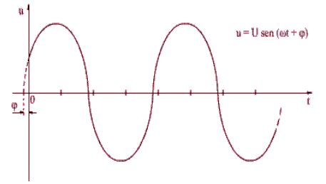
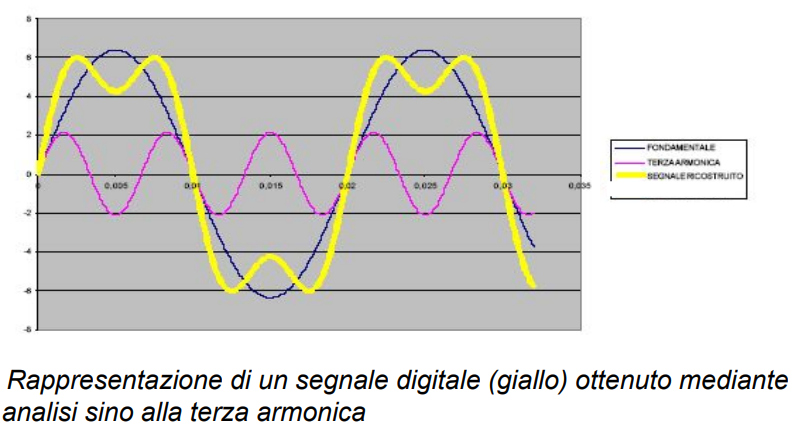
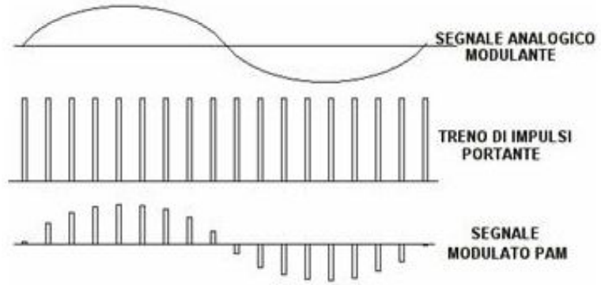
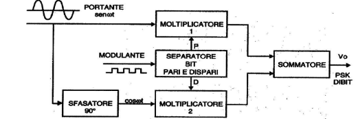

### Comunicazione Dati

Per parlare di processo comunicativo, si parla di

- sorgente di informazione
- cammino fisico
- destinatario
  L'informazione è l'insieme di dati correlati tra loro. Un esempio è la piramide DIKW.
  Il protocollo è l'insieme di regole che consentono la comunicazione e definisce COSA e COME.
  Questi Protocolli sono definiti da standard stabiliti da organizzazioni come ISO, IEEE, ICANN, W3C e senza questi definiti due dispositivi non possono comunicare.
  Il modello TCP/IP ISO ha 4 layer:
- Network Access
- Internet
- Transport
- Application

### Informazione e misura

L'informazione ha come misura il bit e vale: Q=log2M con M numero di stati possibili di un sistema e Q i bit necessari per distinguerli.
Un sistema elaborativo deve avere dei codici per associare le sequenze di bit ad un carattere come BCS, AIKEN, ASCII, UNICODE, ...
I più usati sono l'ascii a 7/8 bit, l'EBCDIC a 8 bit, l'UNICODE.

### Flussi trasmissivi

- Simplex -> unidirezionale
- Half duplex -> bidirezionale a turni
- Full duplex -> bidirezionale diretto

### DTE, DCE, CPE

L'applicazione utente risiede nel Data Terminale Equipment (DTE) come ad esempio un PC.
Il Data Circuit Terminating Equipment (DCE), converte i segnali nella forma migliore per l'invio sul canale.
Il CPE, Custom Premises Equipment si usa in caso sia richiesto un dispositivo di pertinenza dell'utente.

### Le reti ed il loro mondo

La rete è un insieme di dispositivi connessi. Vi sono uno o più nodi capaci di inviare o ricevere dati.
Reti ad elaborazione:

- concentrata -> un DTE potente viene messo a disposizione di altri DTE che ne sfruttano la capacità di calcolo
- distribuita -> DTE diviso in più punti
  Per entrambi i modelli vi sono 3 procedure di colloquio:
- Inquiry -> forma di interrogazione messa a disposizione da servizi del PC
- Conversational -> stabilisce delle regole e formati, bloccando quelli diversi
- Interattivo -> risponde ad applicazioni sensibili. Invia tutte le applicazione che consentono pieno sfruttamento delle risorse elaborative

### Valutazione della Rete

- Affidabilità -> priva di errori, rimedia ai guasti, gestisce bene le situazioni critiche
- Sicurezza -> protezione dei dati da accesso, perdite e modifiche indesiderate
- Prestazioni ->
  - Ritardo -> misurazione tempo di transito dei dati
  - Tempo risposta -> tempo tra richiesta e risposta
  - Throughput -> quantità di dati spediti in unità di tempo
    Queste dipendono da numero di DTE, tipologia dei mezzi e dal software.
  - Banda -> banda passante di frequenze che può essere usata per la trasmissione dei dati. Massima velocità alla quale è possibile trasmettere informazioni. Per valutare la velocità di banda si usano strumenti come ping, traceroute, speedtest, pingtest e netindex

### Tipo di trasmissione

- Point-to-Point -> tra due DTE diretti mediante linea telefonica o dedicata
- Multi-point -> Collegamento condiviso tra più DTE. La condivisione avviene in maniera temporale o condivisone dello spazio del canale.

### Classificazione delle reti

- WAN -> grandi senza limitazione, DTE distanti, arriva fino a Tbits. Sono distribute, quindi anche se un nodo cade, il routing instrada verso un'altra Path.
- LAN -> 1 o 2 km, uso privato, arriva fino a migliaia Gbits. Possono esserci alcuni DTE che fungono da server.
- WLAN -> Reti locali Lan ma senza fili. Usa lo spettro radio. La velocità dipende dallo standard usato.
  - wifi 5 802.11ac 3.5gbps
  - wifi 6 802.11ax 9.6 gbps
  - 2.4ghz -> offre una copertura ampia ma poco potente
  - 5ghz -> copertura meno ampia ma più potente
- MAN ->livello cittadino, fibra ottica ad alta velocità
  _Docker_
  Per sicurezza tutti i software in genere girano come demoni separati all'interno dei software server

### Reti wireless

Usate principalmente per la comunicazione mobile. Abbiamo

- WLAN (802.11)
- WiMax (IEEE 802.16x)
- IEEE 802.20
- CDPD (Cellular Digital Packet Data)

### Struttura delle reti

La topologia di una rete è la configurazione geometrica dei collegamenti fra i vari componenti. Sono volte a creare stabilità, a migliorare il rendimento e a diminuire i costi.

- Rete ad albero -> stazioni a livelli, con un livello centrale. Semplice ma vulnerabile
- Rete a dorsale -> collegamento multi punto via Ethernet. Questa crea una specie di spina dorsale lungo tutta la rete. Questa rete richiedeva anche una speciale terminazione montata a fine del cavo.
- Rete a stella -> ogni nodo è connesso ad un dispositivo centrale. E' più economica rispetto ad una struttura a maglia completa. Ad esempio un ethernet con tipologia a stella aveva un doppino UTP non schermato, quindi in plastica.
- Rete ad anello -> molto usata in passato. Ogni nodo ha un punto-a-punto con solo 2 nodi. Ha una trasmissione unidirezionale, ogni nodo rigenera il segnale. Non supporta errori
- Rete a maglia (MESH) -> tutti i nodi sono collegati tra loro. Il costo totale del percorso è $N(N-1)/2$. Ogni apparato è ha un collegamento Duplex.

### Reti Mesh

Combinazione di nodi fissi e mobili interconnessi tra loro con link wireless per avere una rete auto-configurante multi-hop.
Offre una grande affidabilità, ha una gestione dinamica dei malfunzionamenti, sia per quanto riguarda il collegamento radio che per quanto riguarda la componente hardware della rete.
Vengono monitorati in tempo reale i percorsi disponibili e selezionati quelli migliori

Sono soggette ad un alto tasso di errore visto l'utilizzo di onde radio, dunque serve sviluppare protocolli ottimizzati per il wireless.
La maglia usata tra gli accesso point forma il wireless back haul multi hop, un sistema di comunicazione che fornisce ad ogni utente servizi a basso costo multi hop a banda larga.

- Back haul network = rete comprendente nodi intermedi tra dorsale e nodi periferici
  La rete Mesh risolve le seguenti esigenze:
- trasmissione in movimento e simmetrica (up-link down-link)
- limiti di banda delle strutture ad albero
- reti ad-hoc senza infrastruttura
- configurazione automatica
- radiolocalizzazione senza GPS
- resistenza alle interferenze
- 100% degli IP utilizzabili
- più sicurezza

### WI-FI vs MESH

Nelle reti wifi un guasto blocca tutta la rete mentre nelle reti mesh si ha maggiore tolleranza ai guasti e flessibilità nella pianificazione.

### I Protocolli secondo ISO-OSI

Il compito dei protocolli, ovvero chi gestisce il colloqui tra due DTE o DCE è:

- gestire il flusso dei dati e gli scambi
- controllo degli errori
- sincronizzazione
- strutturare i dati trasmessi
  I protocolli per le relazioni tra due DTE si possono dividere in:
- Ambito Primario/Secondario:
  - Polling/selecting
  - BSC
  - HDLC
  - SNRM
  - RST/CTS -> Si basa su interfaccia seriale RS-232. Una stazione che vuole trasmettere manda un segnale alla stazione master attivando il segnale Request To Send. Se il master può ricevere risponde con un segnale Clear To Send. Questa procedura si basa sull'handshake.
  - XON/XOFF -> usato per terminali vicini tra loro. La stazione primaria invia dati, vengono memorizzati e utilizzati. Quando la memoria si riempe viene mandato un carattere XOFF che impedisce l'invio di nuovi blocchi. Appena il DTE si libera manda un messaggio XON
  - Stop and Wait
  - ARQ -> Automatic Repeat ReQuest o Query. Protocollo Full Duplex che usa il concetto di finestra mobile per essere più efficiente.
- Ambito relazioni ibride
  - HDLC
  - PPP
  - MPLS
- Ambito peer to peer
  - TDM
  - FDM
  - SDH

### La trasmissione Dati

Lo strato fisico deve trasportare dati. Questi sono

- digitali -> rappresentazione discreta
- analogici -> segnale intenso, continuo
  Nei DTE si usa una rappresentazione digitale trascrivendo ogni dato in sequenze di 0 o1.
  I dati vengono sottoposti a:
- conversione in un differente tipo di segnale digitale, con livello 0 o 1
- conversione in analogico (modulazione), quindi un segnale con diversi livelli di intensi

### Segnali Sinusoidali

E' un segnale che varia nel tempo secondo la legge $U = U sin (ωt+Φ)$ dove t è il tempo trascorso, ω velocità angolare e Φ lo sfasamento di fase. La curva descritta prende il nome di sinusoide

Questa curva rappresenta il valore del seno dell'angolo istante per istante che ruota in senso anti orario con velocità $\omega$. Quindi $\Phi$ rappresenta l'angolo che viene formato con l'asse x all'istante 0.

Ruotando tornerà alla posizione di partenza e si ripeterà. Il numero di volte al secondo che il segnale torna allo stato di partenza, si chiama **_FREQUENZA_** e viene calcolata in $Hertz = 1/t$.

Un segnale che ha una frequenza di $1KHz$ vuol dire che percorrerà la circonferenza 1000 volte al secondo. La velocità è data dunque da $2\pi f$. Il periodo che sta nel nel mezzo della ripetizione del segnale si chiama periodo. **$$\omega = 2\pi f$$**
Dunque un'onda portante sinusoidale ha forma del tipo:

$$
s(t) = A cos (2\pi f t+ \Phi) = Asin(\omega t + \Phi + \pi/2)
$$

con A ampiezza della portante, f frequenza e Φ fase

Un periodo è dato dall'unità di tempo diviso la frequenza -> $T=1/f$.
Dunque un segnale con $1Khz$ di frequenza ha periodo di $1/1000$ = 1 millisecondo.
La **lunghezza d'onda** $\lambda$ mette in relazione frequenza e velocità di trasmissione
$\lambda = C/f$ dove $C = 300.000 Km/sec$

Lo spettro è l'insieme di frequenze che il segnale contiene.
La larghezza di banda è l'intervallo delle frequenze contenute in un segnale composto. Se un segnale ad esempio trasmette da 300Hz a 3400Hz la sua larghezza sarà 3100Hz.

### Sviluppo in serie di Fourier

Il teorema di Fourier ci dice che un segnale periodico può essere considerato come la somma di infinite sinusoidi diverse.
Matematicamente: $S(t) = A0+A1sen(ωt+φ1)+A2sen(2ωt+φ2)+A3sen(3ωt+φ3)+…$

Utilizzando sempre più segnali sinusoidali diversi e opportuni, il segnale ricostruito in giallo è sempre più tendente ad una forma quadrata. Questo si ha passando da un'analisi dalla 3 alla 9 armonica. Il numero di armoniche usate per la ricostruzione di un segnale varia in base alla potenza del segnale da rappresentare. In genere si considera l'armonica sino a che la sua ampiezza non sia $1/10$ della grandezza originale.

L'analisi di Fourier ci ricorda che un segnale digitale è un segnale analogico composto da banda teoricamente infinita. Nasce il problema di come trasmettere il segnale analogico come digitale tra 2 punti.

### Filtri

Sistema che tratta in modo specifico le componenti di un segnale a frequenze diverse. Aiuta a separare le informazioni o eliminare il disturbo.
I filtri attivi usano amplificatori operazionali o transistori, quelli passivi usano componenti come resistori o condensatori.

#### Filtro passa basso

Permette il passaggio di frequenze sotto una certa soglia, chiamata frequenza di taglio. In questa sussiste la relazione $: V_{out} / V_{in} = 1/(2)^{1/2}$ dove $V_{out}$ è il segnale in uscita e $V_{in}$ quello in entrata.
Così è attenuato circa di un 30%.

#### Filtro passa alto

Permette il passaggio di frequenze al di sopra della frequenza di taglio.

#### Filtro passa banda

Permette il passaggio di frequenze all'interno di un certo range detto _banda passante_ e attenua quelle fuori da questo range.

#### Filtro elimina banda o filtro notch

Blocca un certo intervallo di frequenze $\omega_L - \omega_H$

### Modulazione di un segnale

Il DTE sorgente immette nel canale un segnale digitale con distribuzione di energia troppo ampia per poter stare dentro un canale telefonico, deve quindi essere convertita.
La modulazione è un'operazione secondo la quale un segnale **_portante_** viene modificato in un parametro essenziale in accordo al segnale informativo d'ingresso, **_modulante_**.

### Modulazione ad onda continua

Ha 3 tipi di modulazione analogica:

#### AM (Amplitude) -> modulazione di ampiezza.

Sistema per il quale si modula l'ampiezza del segnale che si deve trasmettere **_portante_** in maniera proporzionale al segnale che si intende trasmettere, **_modulante_**
Così il segnale modulato ha la stessa frequenza del segnale portante.
In digitale lo 0 è bassa potenze e l'1 alta potenza.
Trasmettendo un segnale modulante del tipo $v_m(t) = v_m cos(\omega_m t + \Phi)$ ponendo $\Phi = 0$.
Sia la portante $v_p(t) = v_p cos(\omega_p t)$ con frequenza maggiore, il segnale modulato in ampiezza diventa:
$v(t) = [V_p + KaV_m cos(\omega_m t)]cos(\omega_p t)$

#### FM (Frequency) -> modulazione di frequenza

Nella AM il rumore che cade nella banda del segnale si somma, degradando così il contenuto informativo. Nella modulazione di frequenza l'ampiezza resta standard, ma cambia la frequenza del segnale. Più l'onda modulante aumenta più l'onda si infittisce. Ha un'efficienza maggiore e risente meno dei disturbi, ma è più complessa da costruire.
La pulsazione della portante varia di frequenza, proporzionalmente al valore della modulante, lasciando l'ampiezza $V_p$ inalterata.
$v_m(t) = V_Msen\omega_mt$
$v_p(t) = V_p sen(\omega_p t + m_f sen\omega_m t)$
con $m_f = (K_f V_M)/\omega_m = (K_f V_M)/2\pi f_m = \Delta f/f_m$

#### PM (Phase) -> modulazione di fase

Simile alla modulazione di frequenza, ma la frequenza del segnale portante è più stabile. Viene spesso usato per amplificare il segnale di sistemi di frequenza.
Si fa variare la fase della portante in modo direttamente proporzionale all'ampiezza modulante .
$V_{PM}(T) = V_P cos(\omega_P t + K_p V_m sin\omega_p t)$

### Modulazione Impulsiva

E' un tipo di modulazione dove l'informazione è codificata in una serie di impulsi.

#### PAM (pulse amplitude modulation)

il segnale analogico varia l'ampiezza del treno di impulsi che costituisce la portante.

#### PWM (pulse width modulation)

l'informazione è codificata sotto forma di durata temporale degli impulsi di un segnale. Il modulante varia la larghezza degli impulsi.

#### PPM (pulse position modulation)

le ampiezze degli impulsi sono identiche, ma la loro posizione viene modificata in base al segnale della modulante. Più il segnale è positivo più viene ritardata la posizione degli impulsi rispetto a quella di riposo e viceversa.

#### PCM (pulse code modulation)

Si applica a canali telefonici e permette di fare passare su un solo cavo coassiale fino a 30 telefonate.

### PDF_6
### PCM (pule code modulation)

Per la sua realizzazione si effettuano 3 operazione a partire dal microfono di ingresso

#### Campionamento

teorema di Shannon: un segnale a banda limitata compreso tra due frequenze $f_1$ e $f_2$ | $f_2>f_1$ può essere rappresentato mediante una successione di campioni prelevati con frequenza pari a $2f_2$.
Si assume come frequenza di campionamento il valore $f_c = 8KHz$ superiore di $1,2 KHz$ al valore minimo di $2f_2 = 6,8 KHz$.
Il periodo sarà dunque $T = 1/f_c = 1/8000 = 125\mu sec$

Si definisce frequenza di Nyquist la minima frequenza necessaria per campionare senza perdere informazione. La minima frequenza è pari al doppio della banda.
Il segnale viene quindi prima campionato poi sostituito dalla frequenza PAM.

#### Quantizzazione

Il dato per essere trasmesso deve assumere solo determinati valori discreti e finiti.
Si definisce prima un massimo e un minimo e si divide l'intervallo creato.
Nella quantizzazione uniforme ogni sotto intervallo è uguale ad ogni altro sotto intervallo.
Dato $n$ il numero di bit usati:

- il numero di livelli sarà $M=2^n$
- l'ampiezza $q = V_{pp}/M$
- la varianza $q^2 /12$
  Essendo la quantizzazione irreversibile, occorre tener conto dell'errore di quantizzazione, nato dal fatto che il segnale vocale può avere infiniti valori mentre la sua discretizzazione no.
  E' provato che usando 256 livelli l'orecchio umano non percepisce differenza.

#### Codifica

L'ampiezza degli impulsi viene trasformata in bit.
Ad esempio se l'ampiezza iniziale del primo impulso è di 5V, sarà rappresentata dalla sequenza binaria 101.

Esempio: vengono spediti 96 impulsi. Il n.0, n.32 e n.64 saranno da vedersi consequenziali come il 5,37,69. Di questi 32 impulsi il n.0 server per dettare il sincronismo, il 16 per il controllo della bontà di trasmissione.
In totale di 30 canali vocali, 2 sono di servizio.
Vengono trasmessi 32 canali con 8000 campioni al secondo. Ogni canale contiene 8 bit, quindi al secondo vengono trasmessi
$V_{bit} = 32*8000*8 = 2048Mbit/s$

Si possono raggruppare più canali.

### Modulazioni digitali

Tecniche che modulano segnali digitali, ossia 0 e 1 o -1 e +1.

#### Modulazione per modem di banda base

per il collegamento tra 2 DTE si parla di codifica volta ad eliminare segnali di bassa frequenza e segnali in componente continua.
Il digitale rimane lo stesso, ma vengono fatte delle modifiche alla portante rispetto al modulante.

#### ASK (amplitude shift keying)

La modulazione a spostamento d'ampiezza trasmette i bit modificando l'ampiezza della portante.

$$
\begin{cases}
Acos(2\pi f t) \ \ \ \ \ bit=1
\\
0 \ \ \ \ \ \ bit = 0
\end{cases}
$$

Semplice ma sensibile al rumore

#### FSK (frequency shift keying)

Modulazione per spostamento di frequenza. I bit vengono trasmessi variando la frequenza della portante mantenendo ampiezza e fase costanti
Più robusta di ASK ma richiede banda maggiore

#### PSK (phase shift)

Si trasmettono i bit modificando la fase portante, mantenendo ampiezza e frequenza costanti. Molto robusta ma può causare discontinuità

#### BPSK (BiPolar Phase shift)

La portante mantiene valori costanti per ampiezza e frequenza, ma per garantire massima protezione da rumore, vengono usati due valori opposti di fase in base al valore del bit, 0° e 180° per rispetttivamente bit 1 e bit 0.
Quindi, l'onda "invertirà" il segnale, quando vi sarà un valore 0, mentre per valore 1 rimane uguale.

#### 4-PSK

Modulazione digitale a 4 fasi. I bit vengono riuniti in coppie usate per modulare in fase la portante sinusoidale. (dibit)

I due bit generano due flussi separati meno veloci di quello originale.
Le due portanti hanno stessa frequenza, ma le loro fasi differiscono di 90°.
La fase del segnale in uscita dal primo modulatore può assumere valori 0° e 180°, il secondo 90° e 270°.
Infine vengono sommate generando un segnale che puù assumere 4 fasi diverse (45°, 135°, 225°. 315°).
Il circuito sfasatore sfasa il segnale portante di 90°.
Al blocco di separazione è applicato in ingresso il segnale modulante $V_i$ che viene separato in bit pari (P) portati al moltiplicatore 1 e dispari (D) portati al moltiplicatore 2.
Inoltre il separatore associa allo stato logico basso +1, mentre a quello alto -1, così da avere un segnale in fase (livello basso) o sfasato di 180° (livello alto) all'uscita del moltiplicatore

### Diagrammi A Costellazione
Rappresentazione teorica del segnale, usata per la comprensione del suo stato.
Il segnale trasmesso in digitale è diviso in 2 segnali modulati in quadratura che non interferiscono denominati I e Q (Infase e Quadratura).
Si crea un diagramma su piano con I e Q come assi e in base allo schema di modulazione i punti nel diagramma saranno più o meno fitti.
Il problema è che a causa di interferenze, il vettore del segnale modulato non si trova in uno dei punti previsti, ma leggermente più o meno spostato a seconda dei disturbi.

### Vettore Errore
Differenza tra il punto teorico e il punto reale.
Può essere descritto caratterizzato dal suo modulo e dalla sua fase

I vettori errori descrivono descrivono quanto "balla" il segnale ricevuto nei dintorni del punto teorico.
Misurandone tanti e tenendo in considerazione il valore quadratico medio del modulo, si ricava un parametro che descrive aa qualità intrinseca della modulazione.

### EVM
Questo parametro è l'ultimo citato sopra ed esprime il valore % dell'errore rispetto al segnale.
Può essere calcolato anche come rapporto espresso in dB tra valore quadratico medio della potenza del vettore e il valore quadratico medio della potenza del segnale ideale di riferimento.

Più grande EVM peggiore la qualità.
Essendo valori piccoli il rapporto espresso in dB assume valori estremamente piccoli. Tanto più negativi quanto migliore il segnal e
>un valore EVM% di 0,10 (10%) rappresenta un segnale peggiore rispetto ad un altro con EVM% di 0,05 (5%)

>un valore EVM di -10 dB rappresenta un segnale peggiore rispetto ad un altro con EVM di -20dB

### PDF_7

### EVM
Il Bel è definito come logaritmo del rapporto tra grandezza X e il suo valore di riferimento $X_0$.
1 Decibel è pari ad 1/10 di Bel. Il decibel relativo ad una grandezza X generica viene espresso nella forma $dB_x = 10log(X/X_0)$.

x=0 => logaritmo = -inf
x=1 => logaritmo = 0
x=valore della bale => logaritmo = 1

E' facile intuire come i valori sempre più negativi di EVM sono i migliori.

EVM si misura con vari strumenti, come analizzatore di segnali, di modulazione, vettoriale,...
E' comune anche la versione software, usato su analizzatori di spettro, digitalizzatori od oscilloscopi.

Il segnale viene demodulato, dai dati demodulati viene ricostruito il segnale ideale che avrebbe dovuto esserci, poi per differenza si ottiene il segnale errore la cui elaborazione porta all'EVM.

Il modo in cui viene riportato dipende dallo strumeto usato. Può essere in forma sintetica tabellare, percentuale o dB.
Può essere anche un grafico della sua evoluzione nel dominio di tempo.
Alcuni strumenti analizzano la fase del vettore altri solamente il modulo.

### Codifica Differenziale DPSK

Per evitare complicazioni di norma si usa una modulazione differenziale, DPSK.
Ai due livelli binari corrisponde o nessuna variazione o 180° (come sopra).
La prima cifra del segnale si individua inviando una sequenza prestabilita ad inizio comunicazione.
Un segnale DPSK ha lo stesso andamento di un PSK quindi ha le stesse caratteristiche spettrali.
Si può anche associare la codifica dei due bit con
$01=90°, 10=180°, 11=-90° o 270$